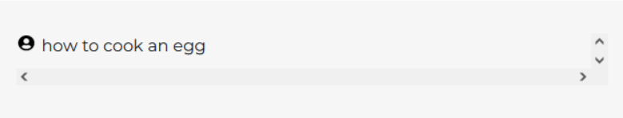
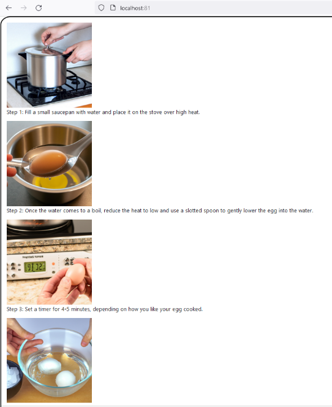
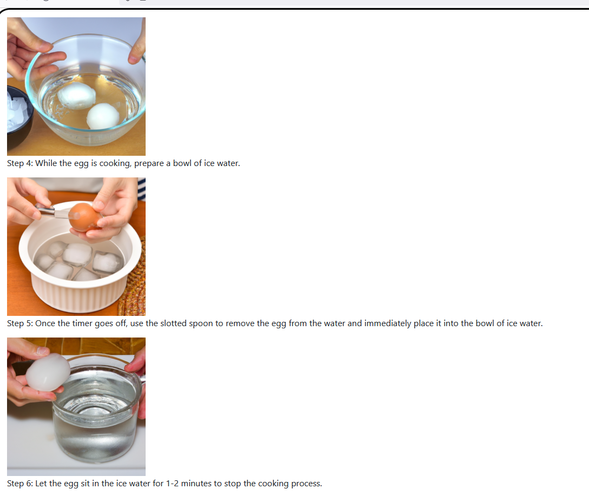

# AMACSS-AI-Olympics-Task-Guidance

Website that generates a list of steps with images for an inquired task

Please read the wiki to get an idea of what to expect from this project!
# Requirements:
<ul>
  <li>Python 3.11</li>
  <li>Flask (run 'pip install Flask' in your terminal)</li>
</ul>

# Instructions:
<ul>
  <li>In your terminal, navigate to the directory where you want to store your project (using the 'cd' command)</li>
  <li>Run the following command: 'git clone https://github.com/Abdullah21818/AMACSS-AI-Olympics-Task-Guidance.git'</li>
  <li>A folder named 'AMACSS-AI-Olympics-Template' should be created. Open this folder in your favorite text editor/IDE.</li>
  <li>Edit the file 'response.py' to implement the text and image features</li>
  <li>To run the project, run the following command in your terminal: 'python3.11 app.py'</li>
</ul>

Have fun!

# Example:

